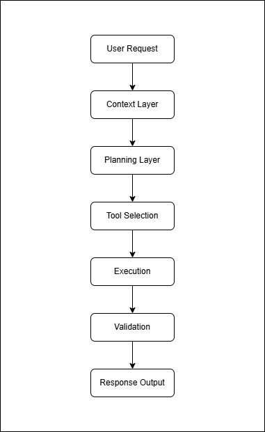
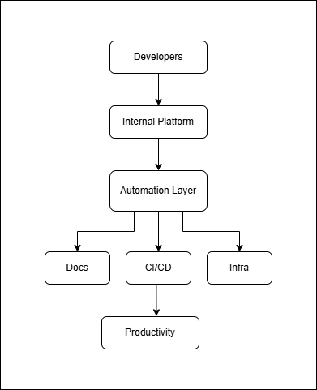

# AI Engineering Agents Platform

A structured engineering repository covering AI Agents, Model Context Protocol (MCP), Agent-to-Agent (A2A) systems, and AI engineering concepts from a Platform Engineering perspective.

This repository focuses on understanding emerging engineering patterns and exploring how AI-native capabilities integrate with modern software delivery ecosystems.

---

## Objective

The goal of this repository is to document concepts, workflows, architecture patterns, and practical references related to AI engineering and Platform Engineering.

Areas of exploration include:

- AI Agents fundamentals
- Multi-agent workflows
- Agent orchestration patterns
- Model Context Protocol (MCP)
- Agent-to-Agent (A2A) communication
- LLM engineering concepts
- AI-enabled Internal Developer Platforms (IDP)
- Developer Experience (DevEx) improvements
- Engineering productivity patterns
- Platform Engineering integration scenarios

---

## Repository Structure

```text
ai-engineering-agents-platform/
│
├── ai-agents/
│   ├── fundamentals/
│   ├── workflows/
│   └── orchestration/
│
├── mcp/
│   ├── concepts/
│   ├── integrations/
│   └── examples/
│
├── a2a/
│   ├── concepts/
│   ├── agent-communication/
│   └── samples/
│
├── llm-engineering/
│   ├── prompting/
│   ├── rag/
│   └── evaluation/
│
├── platform-engineering-ai/
│   ├── ai-for-idp/
│   ├── ai-for-devex/
│   └── developer-productivity/
│
├── diagrams/
│
├── TODO.md
│
└── CHANGELOG.md
```

---

## Architecture Overview

### AI Agent Workflow

<!--  -->


---

### MCP Architecture

<!--  -->


---

### Agent Communication

<!--  -->


---

### Platform Engineering Integration

<!--  -->

---

## Learning Areas

### AI Agents

Understanding agent fundamentals, workflows, planning models, orchestration patterns, and engineering applications.

### MCP (Model Context Protocol)

Exploring standardized approaches for connecting AI systems with external tools and engineering environments.

### Agent-to-Agent (A2A)

Studying communication models, coordination approaches, and distributed execution patterns.

### LLM Engineering

Foundational concepts including prompting techniques, retrieval systems, and evaluation mechanisms.

### Platform Engineering Integration

Understanding practical applications across:

- Internal Developer Platforms (IDP)
- Developer Experience (DevEx)
- Engineering productivity
- Operational efficiency
- Software delivery ecosystems

---

## Purpose

This repository is intended to serve as:

- Structured learning material
- Engineering knowledge reference
- Practical exploration workspace
- Architecture and workflow documentation

---

## Audience

Relevant for engineers interested in:

- Platform Engineering
- DevOps Engineering
- Cloud Infrastructure
- Developer Experience
- Software Architecture
- Modern AI engineering systems

---

## Repository Evolution

This repository will continue evolving through:

- Architecture references
- Engineering examples
- Workflow patterns
- Integration approaches
- Platform Engineering use cases

---

## Long-Term Direction

The long-term objective is to build practical understanding of AI-native engineering capabilities and their adoption within modern engineering platforms.

Focus remains on engineering principles, operational reliability, and scalable platform design.

---
## Additional Resources

Repository supporting assets:

- [TODO](TODO.md)
- [CHANGELOG](CHANGELOG.md)

Architecture assets:

- diagrams/
- examples/

---
