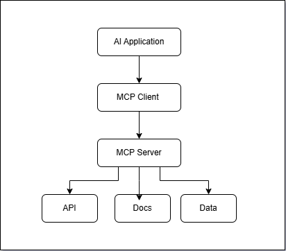
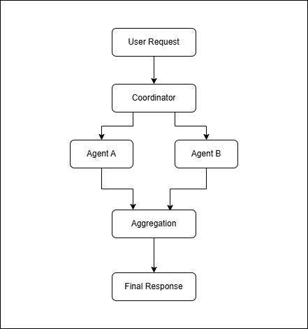

# AI Engineering Agents Platform

A structured engineering repository covering AI Agents, Model Context Protocol (MCP), Agent-to-Agent (A2A) systems, LLM engineering concepts, Platform Engineering integration patterns, and production engineering fundamentals.

This repository is designed as a single engineering reference for:

- Learning
- Architecture understanding
- Workflow visualization
- Production engineering thinking
- Platform Engineering integration
- Engineering discussions
- System design preparation
- Interview preparation

Objective:

Open one repository and revise concepts, workflows, architecture discussions, engineering principles, and production engineering fundamentals efficiently.

---

## Vision

Build practical understanding of emerging AI engineering capabilities and explore how AI-native systems integrate with modern software delivery ecosystems.

Focus areas:

- AI Agents
- MCP (Model Context Protocol)
- Agent-to-Agent (A2A)
- LLM Engineering
- Retrieval systems
- Platform Engineering
- Internal Developer Platforms (IDP)
- Developer Experience (DevEx)
- Engineering productivity
- Reliability patterns
- Operational engineering
- Scaling approaches
- Security fundamentals
- Governance concepts
- Production engineering thinking

---

## Repository Navigation

### Learning Path

Recommended progression:

```text
AI Agents

↓

MCP

↓

A2A

↓

LLM Engineering

↓

Platform Engineering

↓

Production Engineering
```

Learning progression:

```text
Beginner

↓

Intermediate

↓

Advanced

↓

Scenario Discussions

↓

Production Engineering
```

Start here:

```text
00-learning-path/
```

---

### Interview Preparation

Interview preparation areas:

```text
06-interview-preparation/

├── quick-revision.md

├── comparison-table.md

├── ai-agents/

├── mcp/

├── a2a/

├── llm-engineering/

├── platform-engineering/

├── system-design-principles.md

├── production-engineering.md

├── troubleshooting-framework.md

├── operational-patterns.md

├── scaling-patterns.md

├── observability.md

├── security-fundamentals.md

├── governance.md

├── cost-optimization.md

├── tradeoff-analysis.md

└── engineering-principles.md
```

Revision flow:

```text
Quick Revision

↓

Comparison Tables

↓

Topic Notes

↓

Architecture Diagrams

↓

Examples

↓

Production Engineering

↓

Scenario Discussions
```

---

### Engineering Examples

Location:

```text
07-examples/
```

Coverage:

- AI Agent troubleshooting
- MCP integration workflows
- Agent coordination examples
- Platform Engineering workflows

Purpose:

Connect concepts with engineering workflows.

---

### Production Scenarios

Location:

```text
08-production-scenarios/
```

Coverage:

- Deployment failures
- Dependency failures
- Capacity exhaustion
- Latency investigation
- AI operational workflows

Purpose:

Production engineering thinking and troubleshooting mindset.

---

### Architecture References

Location:

```text
09-diagrams/
```

Coverage:

- AI Agent execution workflow
- MCP architecture
- Agent communication patterns
- Platform Engineering integration

Purpose:

Fast architecture understanding and interview revision.

---

## Repository Structure

```text
ai-engineering-agents-platform/
├── 00-learning-path/
├── 01-ai-agents/
├── 02-mcp/
├── 03-a2a/
├── 04-llm-engineering/
├── 05-platform-engineering-ai/
├── 06-interview-preparation/
├── 07-examples/
├── 08-production-scenarios/
├── 09-diagrams/
├── TODO.md
└── CHANGELOG.md
```

## Ecosystem Engineering Alignment

This repository intentionally treats AI engineering as part of a broader production engineering ecosystem rather than an isolated AI tooling domain.

The repository structure reflects operational production engineering concerns including:


---

## Engineering Focus Areas



---

## Production Engineering Mindset



---

## Learning Approach


---

## Learning Areas

### AI Systems

Coverage:

- AI Agents
- MCP
- A2A
- LLM Engineering
- Retrieval workflows

---

### Platform Engineering

Coverage:

- Internal Developer Platforms
- Developer Experience
- Engineering productivity
- Self-service systems

---

### Production Engineering

Coverage:

- Reliability
- Scaling
- Observability
- Security
- Governance
- Cost optimization

---

### Engineering Operations

Coverage:

- Troubleshooting frameworks
- Operational patterns
- Tradeoff analysis
- System design thinking

---

## Design Philosophy

Repository content follows:

```text
Definition

↓

Problem Statement

↓

Architecture

↓

Workflow

↓

Engineering Examples

↓

Operational Thinking

↓

Tradeoffs

↓

Interview Questions

↓

Quick Revision
```

Goal:

Fast learning and efficient revision.

---

## Audience

Relevant for:

- Platform Engineers
- DevOps Engineers
- Cloud Engineers
- Infrastructure Engineers
- Software Engineers
- Developer Experience Engineers
- AI Engineering practitioners

---

## Repository Goal

Build a practical engineering knowledge platform covering:

- Learning
- Revision
- Architecture understanding
- Workflow visualization
- Production engineering thinking
- Platform Engineering integration

Focus remains on:

- Engineering principles
- Operational reliability
- Developer productivity
- Platform design
- Production readiness

---

## Additional Resources

Supporting assets:

- Learning Path
- TODO
- CHANGELOG

Reference areas:

- 07-examples/
- 08-production-scenarios/
- 09-diagrams/

---

Engineering Handbook • Workflow Reference • Production Engineering • Platform Engineering • Interview Preparation
